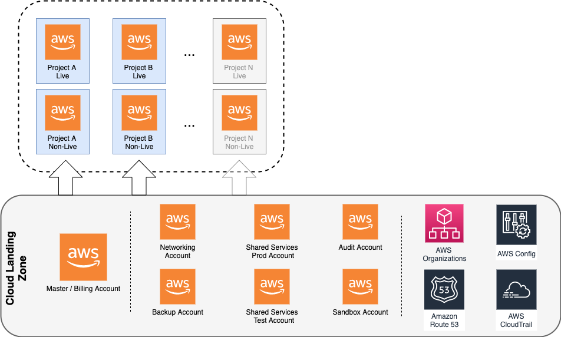

Cloud Landing Zone for AWS (Terraform)
===================================

After doing this over and over across different companies, I decided to write my own code for deploying a basic landing zone while I was between jobs.
This template will work over an existing Amazon Organisations ID and its master account to deploy the following:

 - Transit Gateway
 - Terraform state buckets being replicated to the Backup Account.

Architecture
------------

Deployment Process
------------------

1. On the master account, deploy the content of the `clz-tfstate` directory.

New Account Procedure
---------------------

1.	Execute script to create required files for new account from template.

    `./create_account.sh <ACCOUNT_NAME>`

    This will create all the terraform file to create default configuration.

2.	Commit and merge/apply the Master account directory only.

3.	Once the Master account directory has been applied, add the new account number to the table below then commit the new account directory and create CI build step. Then merge/apply.

4.	Manual Steps to ensure account is secure:

    A. Create a strong password on the account. Using the email and forgot password link. Generate a random min 16 character password, upper and lower alphanumeric plus special.

    B. Login with new credentials.

    C. Go to "My security credentials" and get the root AWS account yubikey and configure MFA, using U2F security key.

    D. Set security questions using security response 1, 2 & 3. Set them to random generated docker names. This can be done here: https://gist.github.com/YumaInaura/0c8de43e3342db53059584661d0b491e#example-use-names-generator-directly

    E. Unsubscribe email from marketing lists.

Accounts
--------
This table is very useful to keep track of the existing AWS accounts.

| Name                     | IAM Alias                             | Number       | Email                                 | Purpose                                                                                                  | DNS Prefix       | Notes |
|:-------------------------|:----------------------------------|:-------------|:--------------------------------------|:---------------------------------------------------------------------------------------------------------|:-----------------|:------|
| master                   | my-company-master                   | 012345678900 | aws+master@mycompany.domain                  | Master organisation billing account                                                                      |                  |       |
| backup                   | my-company-backup                   | 012345678900 | aws+backup@mycompany.domain                  | Storage backup account contains all replicated buckets incase of disaster or compromise of main accounts |                  |       |
| network                  | my-company-network                  | 012345678900 | aws+network@mycompany.domain                 | Contains all shared networking components, Transit Gateway, main Route53 domain, etc...                  |                  |       |
| audit                    | my-company-audit                    | 012345678900 | aws+audit@mycompany.domain                   | Centralised Cloudtrail and Cloudwatch logs                                                               |          	      |       |
| shared_services_live     | my-company-shared-services-live     | 012345678900 | aws+shared_services_live@mycompany.domain    | Shared Services Live production account                                                                  | live.services      |       |
| shared_services_non_live | my-company-shared-services-non-live | 012345678900 | aws+shared_services_non_live@mycompany.domain| Shared Services Non-Live development, test, pre-prod account                                             | nonlive.services   |       |
| project-a_live           | my-company-project-a-live           | 012345678900 | aws+project-a_live@mycompany.domain           | Project A Live production account                                                                       | live.project-a     |       |
| project-a_non_live       | my-company-project-a-non-live       | 012345678900 | aws+project-a_non_live@mycompany.domain       | Project A Non-Live development, test, pre-prod account                                                  | nonlive.project-a  |       |
| project-b_live           | my-company-project-b-live           | 012345678900 | aws+project-b_live@mycompany.domain         | Project B Live production account                                                                         | live.project-b     |       |
| project-b_non_live       | my-company-project-b-non-live       | 012345678900 | aws+project-b_non_live@mycompany.domain     | Project B Non-Live development, test, pre-prod account                                                    | nonlive.project-b  |       |
| sandbox                  | my-company-sandbox                  | 012345678900 | aws+sandbox@mycompany.domain                     | Sandbox experimentation account                                                                      | sandbox            |       |

### Legacy Accounts

| Name        | IAM Alias         | Number       | Email                    | Purpose                    | Notes                                  |
|:------------|:--------------|:-------------|:-------------------------|:---------------------------|:---------------------------------------|
|   |  |  |   |   |   |
